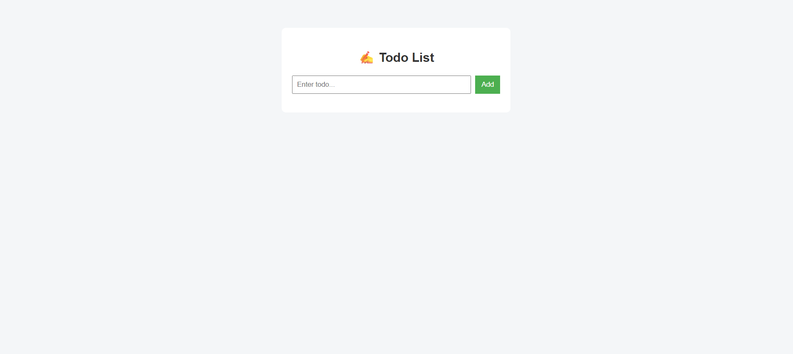
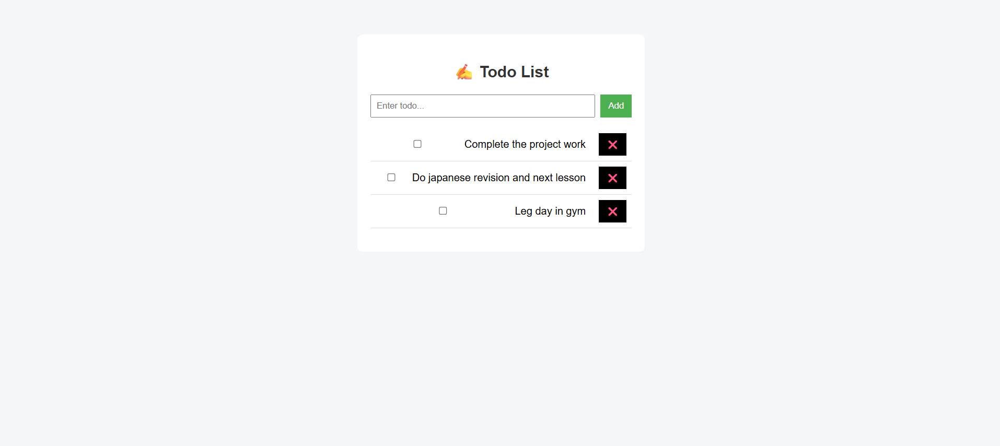
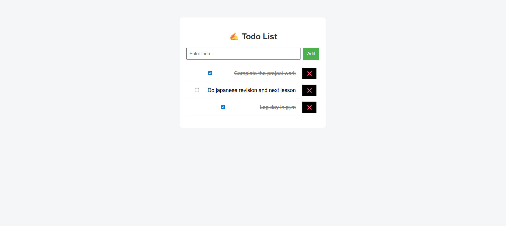
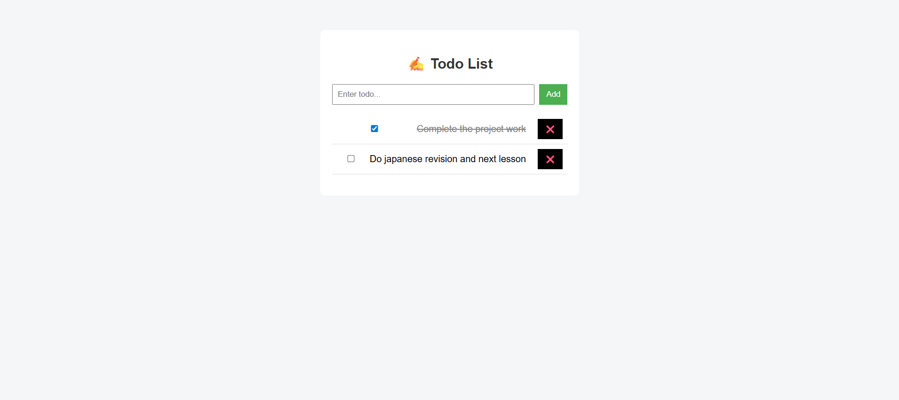

---

## 📘 TODO MANAGEMENT

```md
# Todo Management Application

A simple and clean Todo application built using Spring Boot and React.

## Features

- Add, update, delete todos
- Mark todo as completed using checkbox
- Backend validation and global exception handling
- Clean and user-friendly UI

## Tech Stack

- Backend: Java, Spring Boot, JPA
- Frontend: React, JavaScript, CSS

## How to Use

- Add todo using input field
- Double-click to edit todo
- Use checkbox to mark completed
- Delete todo using ❌ button

## How to Run

- Backend runs on port 8080
- Frontend runs on port 3000
```

## Screenshots

### Todo-list Dashboard



### Add Todo



### Todo Complete



### Delete Todo


